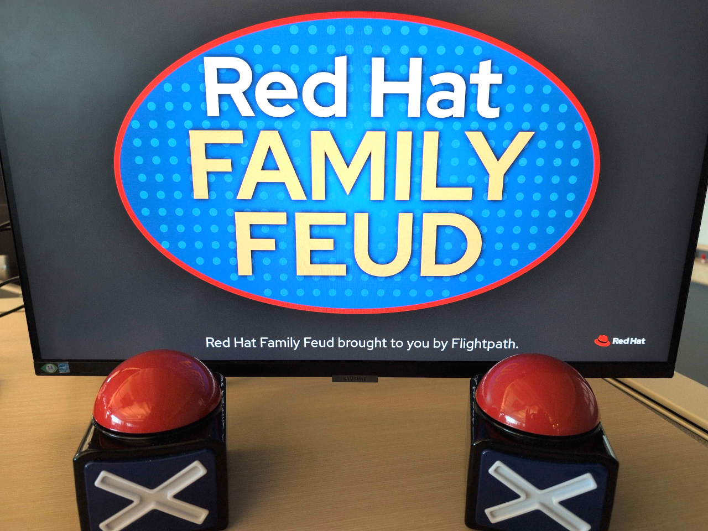
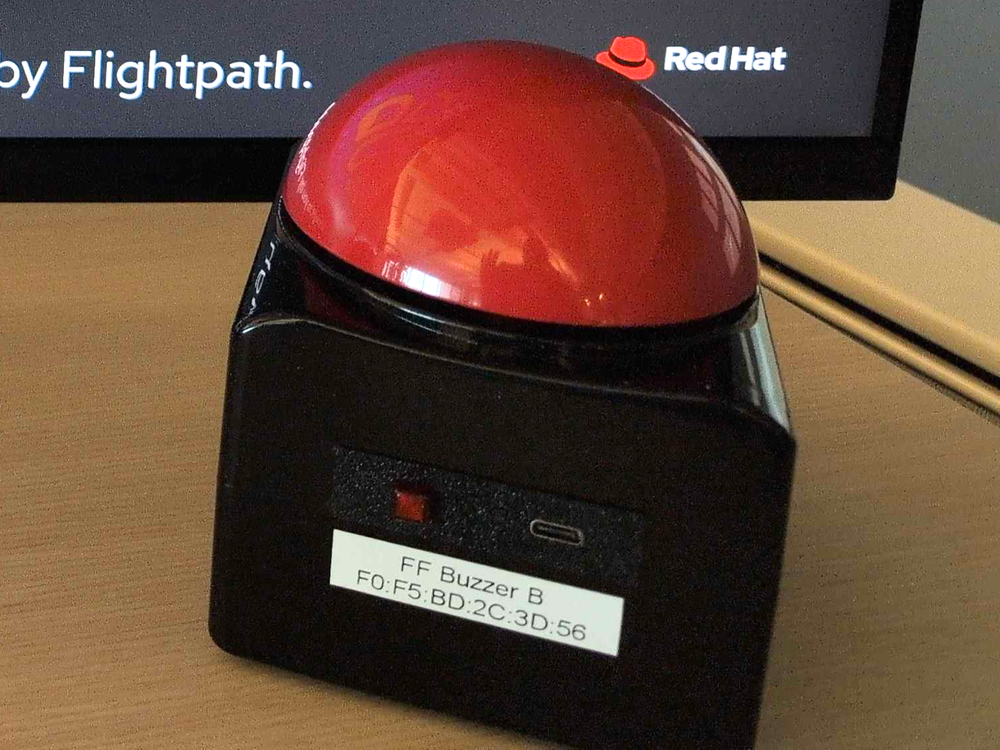
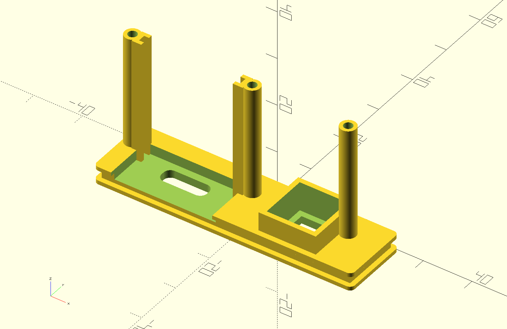

# Game Show Buzzer Buttons

Just some files and code we used to mod these toy game show buzzer buttons. Not polished or even presentable for now. We'll make it better before we scale up production!

Each button connects using Bluetooth to the laptop presenting the game show. When a button is pressed, a keyboard event is sent, triggering a custom keyboard shortcut that runs the [`buzzer.sh`](./buzzer.sh) script. 

When activated, the script plays the buzzer sound and then uses [`hudkit`](https://github.com/anko/hudkit) to pop up an overlay on the laptop display showing which team buzzed in first. The buzz in from the losing team updates the overlay displaying the time difference.

## Photos

Behold our finished buzzer buttons being demonstrated with an example game show.

The back panel of each button sports a power switch that also serves as a Bluetooth pairing status indicator. Next to that is a USB-C port used for charging the internal battery.

Here is a screenshot from [OpenSCAD](https://openscad.org/) showing the solid model used to 3D print the back panel and ESP32 card slot.

## Licensing

MIT

See [LICENSE](LICENSE) to see the full text.

